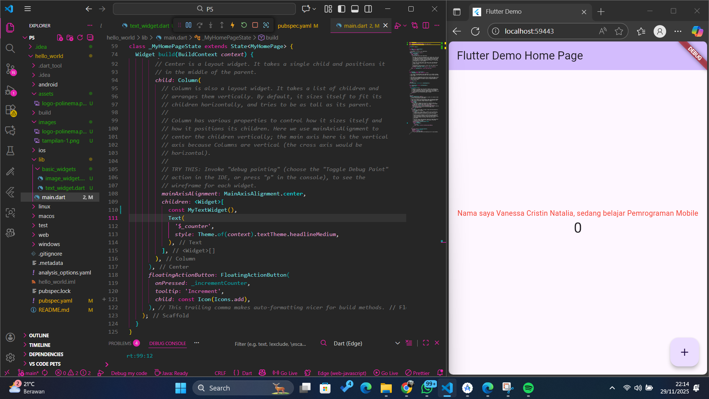
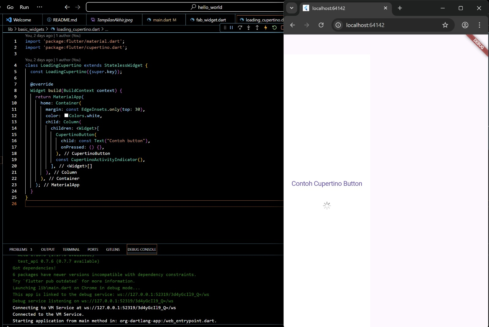
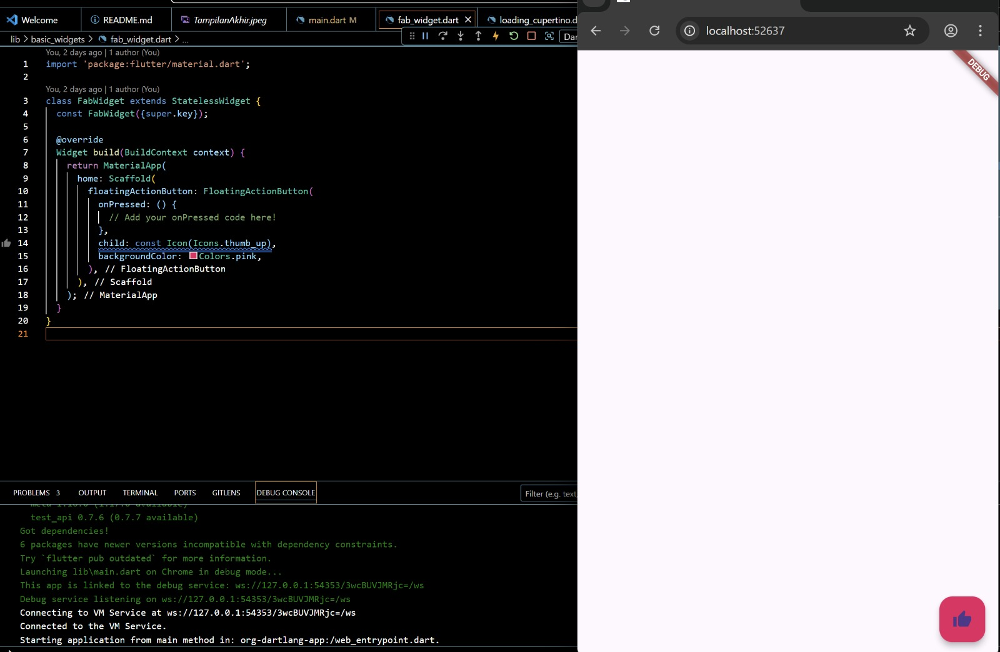
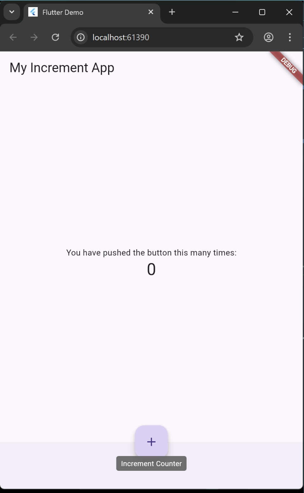
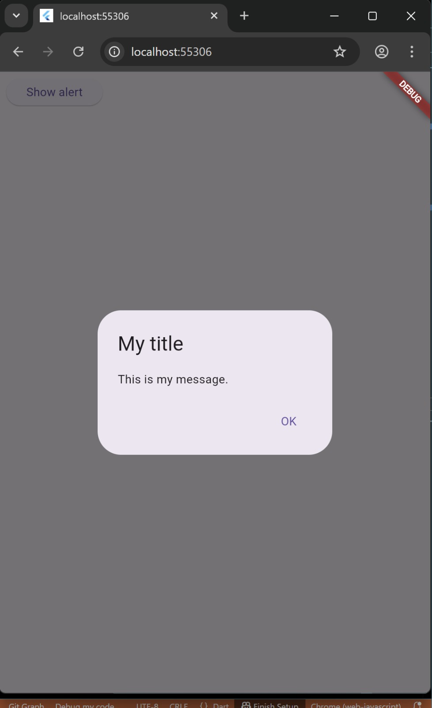
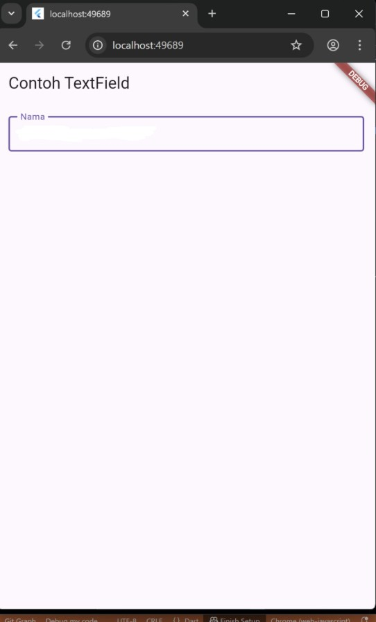
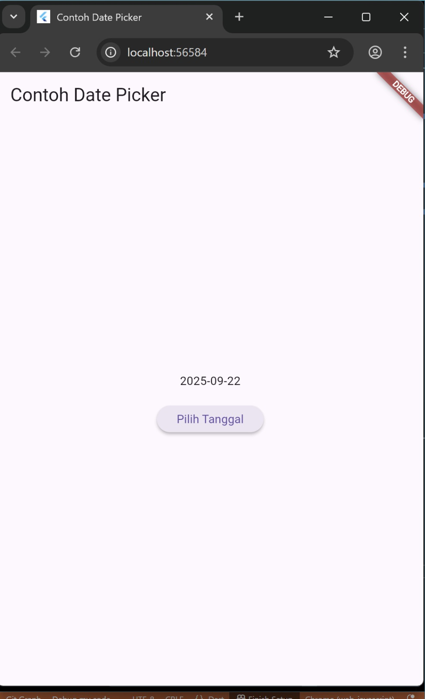
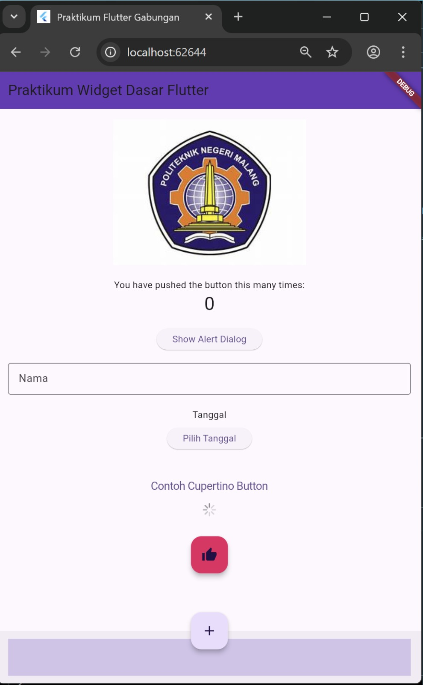

# hello_world

A new Flutter project.

## Getting Started

This project is a starting point for a Flutter application.

A few resources to get you started if this is your first Flutter project:

- [Lab: Write your first Flutter app](https://docs.flutter.dev/get-started/codelab)
- [Cookbook: Useful Flutter samples](https://docs.flutter.dev/cookbook)

For help getting started with Flutter development, view the
[online documentation](https://docs.flutter.dev/), which offers tutorials,
samples, guidance on mobile development, and a full API reference.

# Praktikum 4-logo

# Langkah 1 – Cupertino Button dan Loading Bar
menampilkan contoh tombol CupertinoButton dan indikator loading ala iOS (CupertinoActivityIndicator) agar kita mengenal widget bergaya iOS di Flutter.

# Langkah 2 – Floating Action Button (FAB)
menampilkan FloatingActionButton berwarna pink dengan ikon tumbs up, yang biasanya dipakai untuk aksi utama dalam sebuah halaman aplikasi Flutter.

# Langkah 3 – Scaffold Widget
Scaffold digunakan untuk membuat kerangka layout Material Design, termasuk AppBar dan FloatingActionButton.

# Langkah 4 – Dialog Widget
Dialog digunakan untuk menampilkan pop-up pesan sederhana kepada user.

# Langkah 5 – Input dan Selection (TextField)
TextField dipakai untuk menerima input teks dari user.

# Langkah 6 – Date and Time Pickers
DatePicker memungkinkan user memilih tanggal dari kalender.

# Tampilan Akhir
